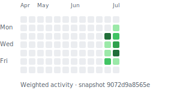

# Comfy

*Shared openly as homework. Part of this repo is a method for understanding a community before building for it. Part of it is the later build sessions where that understanding finally cashed out into some unusually cross-system tools.*

> **Active program (2026-07-09 →):** the Valheim netcode-replacement effort. State of the world:
> [fieldlab/GROUND-TRUTH.md](fieldlab/GROUND-TRUTH.md) · plan:
> [fieldlab/TEST-PROGRAM.md](fieldlab/TEST-PROGRAM.md). Start sessions in `C:\work\comfy` root
> (never a subdir — memory/MCP don't inherit on Windows).

<!-- repo-activity:start -->
## Repository activity map

The map below is generated from Git history: first-seen date × last-updated date, weighted by current KB and change activity.

[Explore the interactive heatmap](docs/repo-map/index.html) · [Read the hotspot report](docs/repo-map/HOTSPOTS.md) · [Inspect the raw metrics](docs/repo-map/activity.json)

### Current hotspots

| Area | Activity score | Files | Size KB | Start here |
|---|---:|---:|---:|---|
| `fieldlab` | 5661.81 | 113 | 2639.19 | [README](fieldlab/README.md) |
| `network` | 3267.09 | 77 | 801.57 | [README](network/README.md) |
| `handoffs` | 2246.15 | 70 | 349.44 | [README](handoffs/README.md) |
| `docs` | 1025.86 | 29 | 638.55 | [README](docs/README.md) |
| `data` | 684.75 | 21 | 11403.38 | [README](data/README.md) |
| `recipes` | 409.04 | 14 | 66.22 | [README](recipes/README.md) |
| `quest_select_design` | 190.70 | 5 | 327.69 | [README](quest_select_design/README.md) |
| `discord-search-export` | 143.58 | 3 | 20.79 | [README](discord-search-export/README.md) |
| `tools` | 119.87 | 2 | 28.50 | [README](tools/README.md) |
| `framework` | 101.50 | 3 | 9.03 | [README](framework/README.md) |
| `erasave` | 81.95 | 2 | 59.17 | [README](erasave/README.md) |

Metrics snapshot: `9072d9a8565e`. Regenerate with `python tools/repo_activity.py --write`.
<!-- repo-activity:end -->

## What this repo is

This repo is not one tidy product.

It grew in layers:

1. a **core session** about understanding the Comfy community from multiple human seats
2. a **process capture** phase that turned that session into reusable docs and working method
3. a set of **small projection builds** and later **vibe-built vertical slices** that used the understanding as source material
4. a small **network research fork** for shareable multiplayer architecture notes

If you open the repo cold, the important distinction is:

- some files are trying to explain the world
- some files are trying to explain the method
- some files are actual build artifacts from later sessions

## The three parts

### 1. Core understanding

This is the part of the repo that tries to answer: *what was Comfy, what was broken, what mattered, and what shape of intervention made sense?*

Read:

- `docs/kernel.md` - the locked thesis the rest of the repo resolves to
- `docs/perspectives/` - the human lenses that built that thesis
- `docs/community-insights.md` - the raw threads underneath it
- `docs/personas.md`, `docs/governance.md`, `docs/positioning.md`, `docs/adoption-strategy.md` - the supporting model around the kernel

### 2. Process and method

This is the part that tries to answer: *how was the understanding built, and what about that process is reusable?*

Read:

- `docs/method/the-lens-first-playbook.md` - the distilled operating discipline
- `docs/method/conversation-ledger.md` - the turn-by-turn record
- `docs/method/conversation-extract.md` - the long-form session transcript
- `framework/PHILOSOPHY.md` - why the repo stayed deliberately open, small, and craftable

### 3. Build sessions and projections

This is the part most likely to surprise someone who only read the earlier README.

These are the places where the repo stopped being mostly about restraint and started proving
what that restraint could unlock:

- `recipes/rank-ladders/` - rank requirements rendered into machine-usable action definitions
- `recipes/quest-catalogs/` - live guild tracker absorption -> canonical quest catalogs -> anomalies -> picker input
- `handoffs/valheim-camera-proof/` - the first proof that the local Valheim modding path worked
- `handoffs/comfy-control-surface/` - the live control-surface mod and local review/export bridge
- `docs/quest-vertical-slice-architecture.md` - the best single end-to-end map of the later cross-system build

## How the repo grew

If the repo feels hard to read, that is because it grew by different sessions with different goals.

### Session 1: understand the world before building

Goal:
lock the kernel, gather perspectives, resist premature building

Best entry points:

- `docs/kernel.md`
- `docs/perspectives/README.md`
- `docs/method/the-lens-first-playbook.md`

### Session 2: capture the process as something teachable

Goal:
turn one good session into reusable method docs and public homework

Best entry points:

- `docs/method/`
- `README.md`
- `framework/PHILOSOPHY.md`

### Session 3: prove the local-first modding path

Goal:
verify that Valheim + BepInEx + local files could support a real workflow slice

Best entry points:

- `handoffs/valheim-camera-proof/README.md`
- `handoffs/README.md`

### Session 4: build the control-surface vertical slice

Goal:
take an in-game action to a local outbox, human review, and exported guild command

Best entry points:

- `handoffs/comfy-control-surface/README.md`
- `handoffs/comfy-control-surface/QUEST.md`
- `handoffs/REBOOT-HANDOFF.md`

### Session 5: the quest vertical slice

Goal:
absorb real guild quest data, let a player choose quests in a local web UI, load them in-game,
listen for actions like punches and killing blows, auto-capture evidence, and route that evidence
through the same local review/export plumbing

Best entry points:

- `docs/quest-vertical-slice-architecture.md`
- `handoffs/quest-log-retrospective.md`
- `recipes/quest-catalogs/schema.md`
- `recipes/quest-catalogs/quest-view-schema.md`
- `data/processed/quest-picker.html`

This is also the first serious proof of the repo's `absorptionHub` direction: messy live
community data absorbed, normalized only at the plumbing layer, then projected into a real
player-facing and GM-facing workflow.

## Reading paths

### If you want the thesis

- `docs/kernel.md`
- `docs/perspectives/`
- `docs/community-insights.md`

### If you want the method

- `docs/method/the-lens-first-playbook.md`
- `docs/method/conversation-ledger.md`
- `framework/PHILOSOPHY.md`

### If you want the most interesting build

- `docs/quest-vertical-slice-architecture.md`
- `handoffs/quest-log-retrospective.md`
- `handoffs/comfy-control-surface/README.md`

### If you want the base-layer plan

- `fieldlab/README.md`
- `docs/comfy-base-layer-architecture-plan.md`
- `docs/lumberjacks-native-runtime-era-save-plan.md`
- `docs/thesis-gold-local-lab-plan.md`
- `network/README.md`
- `docs/adoption-strategy.md`

### If you want the current practical handoff

- `handoffs/REBOOT-HANDOFF.md`
- `handoffs/comfy-control-surface/QUEST.md`

## How the pieces connect

The later build chain looks like this:

`docs/kernel.md` -> `recipes/quest-catalogs/` and `recipes/rank-ladders/` ->
`data/processed/quest-picker.html` -> `quest-view.json` ->
`handoffs/comfy-control-surface/` -> local review/export

The earlier camera/gallery handoff matters because it proved the same local modding surface
that the later control-surface and quest-slice work depend on.

## What is unique here

The unusual thing in this repo is not just "AI helped build some code."

It is the combination of:

- deep prior human understanding
- explicit process capture
- local-first contracts instead of a hosted platform
- absorption of messy live community truth
- cross-system projections that connect data intake, UI, game runtime, evidence capture, and human review

That is why a file like `docs/quest-vertical-slice-architecture.md` exists here at all.
It only makes sense because the repo is both the understanding and the build history.

## Network research fork

There is now also a small top-level research fork in `network/`.

That directory is for shareable notes about multiplayer architecture: bandwidth budgets,
priority-ranked replication, interest management, transport fallback, and the older design
discipline that came from building for weaker machines and weaker links.

Best entry points:

- `network/README.md`
- `network/research-framing.md`

## The principle that still holds

Execution got cheaper; intention did not.

The core claim of the repo is still that understanding should lead and automation should
follow. The difference is that the later sessions now give concrete examples of what that
looks like when it works.
