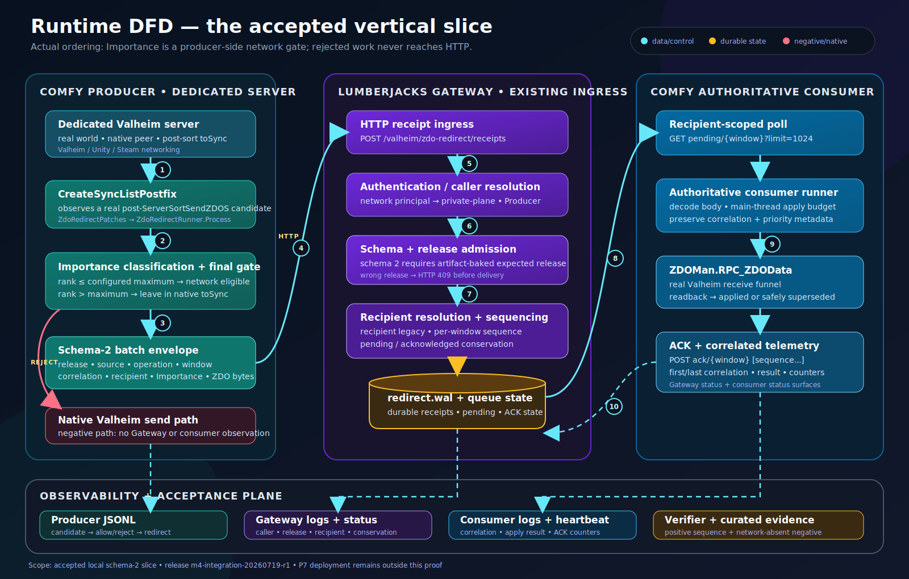
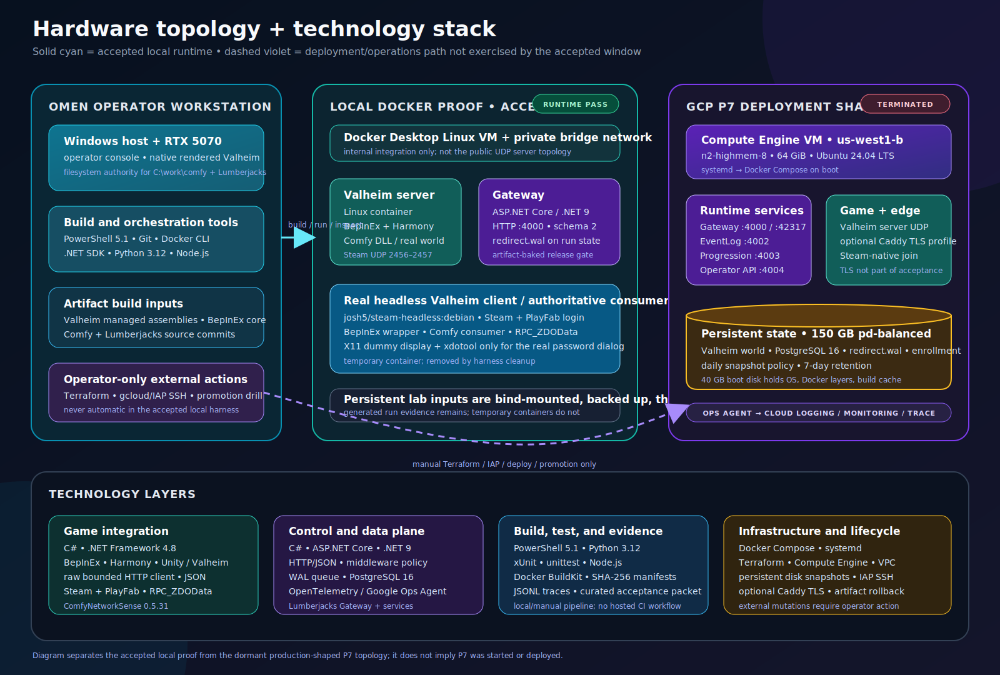
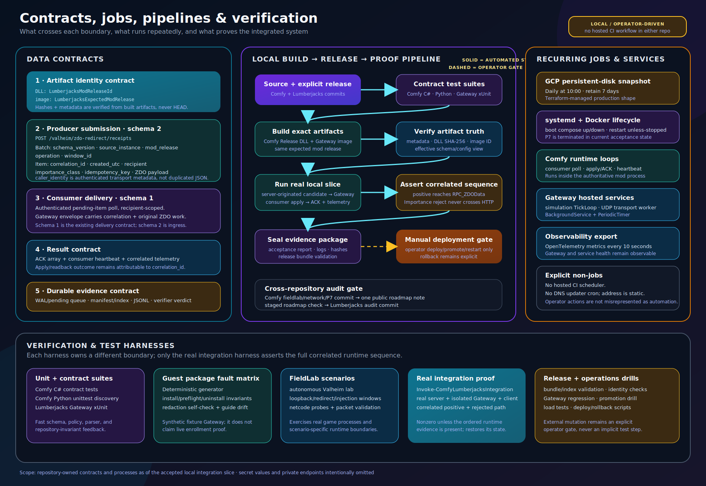

# Comfy + Lumberjacks architecture diagrams

These diagrams describe the accepted local integration slice and the production-shaped P7 deployment separately. They are source-derived views, not a claim that P7 was running during acceptance. Secret values, private endpoints, Steam identities, and credentials are intentionally omitted.

There is no hosted CI workflow in either repository. The operations diagram therefore shows the actual local/operator-driven build, release, verification, deployment, and rollback path instead of inventing a cloud pipeline.

## Runtime data-flow

[Open the standalone SVG](runtime-data-flow.svg).

The diagram follows a real server-originated ZDO candidate from `CreateSyncListPostfix` through the Comfy Importance gate, the schema-2 Lumberjacks ingress, authentication and release admission, recipient routing, the authoritative consumer's `RPC_ZDOData` apply/readback, ACK, and correlated telemetry. The rejected path remains native and does not cross HTTP.

Primary sources:

- `network/mod/ComfyNetworkSense/Core/Services/NetcodeProbeRunner.cs` and `ZdoRedirectRunner.cs`: producer hooks, Importance decision, redirect submission, consumer polling, ACK, heartbeat, and telemetry.
- `fieldlab/scripts/Invoke-ComfyLumberjacksIntegration.ps1`: real local runtime orchestration.
- `tools/verify_comfy_lumberjacks_integration.py`: ordered positive-path and network-absent negative-path assertions.
- `fieldlab/integration/COMFY-LUMBERJACKS-ACCEPTANCE.md`: accepted evidence and limitations.
- Lumberjacks `src/Game.Gateway/Valheim/ValheimZdoRedirectService.cs` and its mapped endpoints: ingress, admission, queue, delivery, and ACK behavior.

## Hardware and technology stack

[Open the standalone SVG](hardware-tech-stack.svg).

The local proof runs on the Windows operator workstation through Docker Desktop: a real dedicated Valheim server, an isolated release-admitting Gateway, and a headless Steam client. The P7 panel describes the Terraform/Docker/systemd deployment shape and is marked terminated to preserve the acceptance boundary.

Primary sources:

- `fieldlab/autonomous/valheim-lab.compose.yml`: local Valheim lab topology.
- `fieldlab/scripts/Invoke-ComfyLumberjacksIntegration.ps1`: accepted local containers, network, and cleanup ownership.
- `infra/gcp/p7/main.tf`: GCP machine, disks, address, and snapshot policy.
- `infra/gcp/p7/docker-compose.yml`: P7 service topology and persistence.
- `infra/gcp/p7/comfy-lumberjacks-p7.service`: boot-time Docker Compose lifecycle.
- Lumberjacks `src/Game.Gateway/Dockerfile` and project files: .NET 9 Gateway image and service stack.

## Contracts, jobs, pipelines, and harnesses

[Open the standalone SVG](contracts-jobs-pipelines.svg).

This view distinguishes body fields from authenticated transport metadata, schema-2 producer ingress from schema-1 consumer delivery, automated local steps from operator gates, and recurring services from scheduled infrastructure work. It also shows which harness owns each proof boundary.

Primary sources:

- `fieldlab/integration/comfy-lumberjacks-seam.md`: explicit envelope and seam map.
- `infra/gcp/p7/scripts/New-ReleaseCut.ps1`, `New-GatewayReleaseCut.ps1`, `build-release-bundle.ps1`, and `validate-release-bundle.ps1`: artifact and release pipeline.
- `infra/gcp/p7/scripts/Test-GatewayImageRelease.ps1`, `Test-GatewayImageReleaseRegression.ps1`, and `run-promotion-drill.ps1`: release identity and operations drills.
- `tools/guest-package/build-guest-package.ps1`, `tools/render_guest_guide.py`, and `tests/test_guest_package.py`: guest-package determinism, fault matrix, redaction, uninstall, and drift checks.
- `fieldlab/scripts/run-netcode-probe-cycle.ps1`, `run-autonomous-valheim-lab.ps1`, `run-loopback-window.ps1`, `run-redirect-window.ps1`, `run-injection-window.ps1`, and `validate-run-packet.ps1`: FieldLab scenario and evidence harnesses.
- Lumberjacks `src/Game.Simulation/Tick/TickLoop.cs` and `src/Game.Gateway/WebSocket/UdpTransport.cs`: in-process recurring services.
- Lumberjacks `package.json`: local build, test, lint, load-test, and roadmap commands.

## Reading conventions

- Solid cyan arrows are automated data or pipeline transitions.
- Dashed amber arrows are deliberate operator gates.
- "Accepted local" means observed in the committed integration evidence.
- "Production shape" means represented by committed deployment artifacts; it does not mean live infrastructure was started.
- Different ingress and delivery schema numbers are intentional boundary versions, not conflicting release identifiers.
